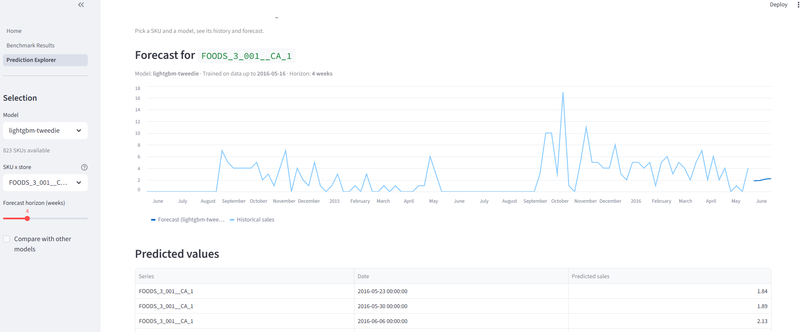
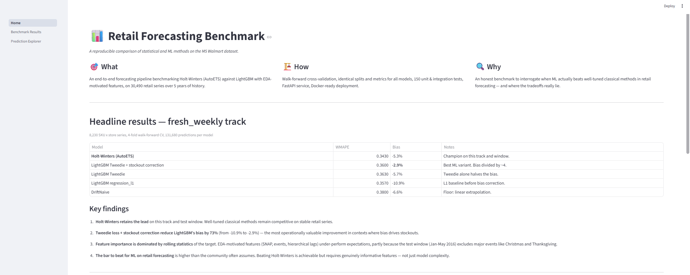
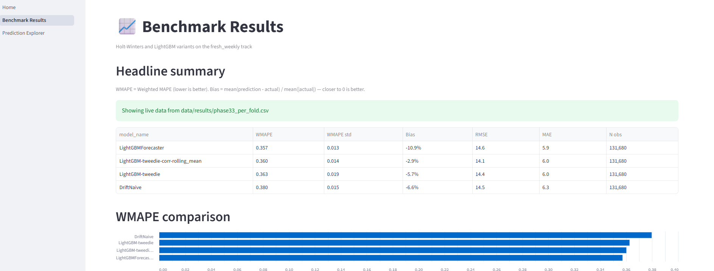

# Retail Forecasting Benchmark

A reproducible end-to-end forecasting pipeline benchmarking Holt-Winters and LightGBM on the [M5 Walmart dataset](https://www.kaggle.com/competitions/m5-forecasting-accuracy), with an honest analysis of when ML actually beats well-tuned classical methods.

[](https://github.com/Tinevagio/retail-forecasting-benchmark/actions/workflows/ci.yml)




## TL;DR

On 8,230 grocery SKUs over 4 walk-forward folds (131,680 predictions per model):

| Model | WMAPE | Bias | Notes |
|-------|-------|------|-------|
| **Holt-Winters (AutoETS)** | **0.343** | -5.3% | Champion on this track |
| LightGBM Tweedie + stockout correction | 0.360 | **-2.9%** | Best ML variant. Bias divided by ~4 |
| LightGBM Tweedie | 0.363 | -5.7% | |
| LightGBM regression_l1 | 0.357 | -10.9% | |
| DriftNaive | 0.380 | -6.6% | Baseline |

**The takeaway**: well-tuned Holt-Winters retains the lead on this track and test window. LightGBM with EDA-motivated features doesn't beat it on WMAPE — but Tweedie loss + stockout correction divide the bias by ~4, the most operationally valuable improvement in supply-chain contexts.

## Why this project

There's a recurring claim in retail forecasting that ML beats classical methods. In practice, the picture is more nuanced — well-tuned Holt-Winters often holds its own, especially on stable series with weak seasonality. This benchmark exists to interrogate that claim **fairly**: identical splits, identical metrics, identical infrastructure for every model, plus an honest reading of where each method actually shines.

## Quick start

### Run with Docker (recommended for first try)

Requires [Docker Desktop](https://www.docker.com/products/docker-desktop/).

```bash
make train         # train a model on store CA_1 (~3 min)
make docker-build  # build the API image
make docker-run    # start the API at http://localhost:8000

curl http://localhost:8000/health
# {"status":"ok","n_models_loaded":1}
```

Interactive Swagger documentation: <http://localhost:8000/docs>

### Run locally with Python

Requires Python 3.11+ and [uv](https://github.com/astral-sh/uv).

```bash
make install      # install dependencies into .venv
make train        # train the model
make serve        # start the API at http://localhost:8000
make dashboard    # start the Streamlit dashboard at http://localhost:8501
```

## Dashboard

A standalone Streamlit dashboard tells the project story and lets you explore predictions interactively.

| Home | Benchmark | Prediction Explorer |
|---|---|---|
|  |  |  |

Pick any of the 8,230 SKUs, choose a model, see its forecast against 2 years of historical sales.

## Architecture

```
retail-forecasting-benchmark/
├── src/forecasting/
│   ├── data/           # Loading, walk-forward CV splits, hierarchical aggregation
│   ├── features/       # Lags, rolling stats, calendar, SNAP, events, hierarchical, promo, stockout correction
│   ├── models/         # Forecaster ABC + naive, Holt-Winters (AutoETS), LightGBM
│   ├── evaluation/     # CV runner, WMAPE/bias/RMSE/MAE metrics, segmented analysis
│   └── serving/        # FastAPI app, pickle persistence with versioning, Parquet feature store
├── dashboard/          # Streamlit multi-page app
├── scripts/            # Benchmark runners, training-for-serving pipeline
├── tests/              # 154 unit + integration tests, 88% coverage
├── docs/               # EDA findings, benchmark results, screenshots
├── Dockerfile          # Multi-stage build, non-root user, healthchecks
├── docker-compose.yml  # Local dev with volume-mounted artifacts
└── Makefile            # Common workflow shortcuts
```

### Design principles

- **Same runner for every model**. The `Forecaster` ABC defines a `fit/predict` contract that naive baselines, Holt-Winters, and LightGBM all implement. The evaluation runner sees them as equivalent — no metric leakage from inconsistent eval code.
- **Walk-forward splits, no leakage**. 4-fold time-series CV with explicit train/test boundaries. A `gap` parameter is exposed for forward-looking features.
- **Stockout-aware training**. Suspicious zeros (zero following non-zero rolling mean) are imputed in the training target only — evaluation is always against raw sales.
- **Tweedie loss for retail demand**. The Tweedie distribution interpolates between Poisson (count of events) and Gamma (positive continuous), making it suited to data that mixes many zeros with positive sales.
- **Quality gates**. Ruff strict, mypy strict, pytest with coverage threshold, GitHub Actions CI on every push. The same hooks run locally via pre-commit.

## Methodology

### The track

The headline benchmark runs on the `fresh_weekly` track:

- **Universe**: FOODS_3 SKU × store, 8,230 series, 5 years of history
- **Granularity**: weekly aggregation (sales summed Monday–Sunday)
- **Horizon**: 4 weeks per fold
- **Walk-forward**: 4 folds covering Jan-May 2016
- **Predictions**: 131,680 per model (8,230 series × 4 folds × 4 weeks)

Two more tracks (`dry_monthly` and `non_food_monthly`) are configured but not yet evaluated end-to-end.

### Feature set (LightGBM)

31 features across 5 families, all motivated by the [phase 1 EDA](docs/eda_findings.md):

- **Lags** at 1, 2, 4, 8, 13, 26, 52 weeks
- **Rolling stats** (mean, std) over 4, 13, 26 weeks
- **Calendar** (month, week of year, year, day of year)
- **SNAP days per week** (state-aware: California, Texas, Wisconsin)
- **Named events** flagged individually (Christmas, Thanksgiving, Pesach End, Purim End, Labor Day, Super Bowl) plus a catch-all
- **Hierarchical lag-1 means** at department, store, and category levels
- **Promo features** (`is_on_promo` derived from price drops, `price_relative_to_ref`)

### Stockout correction

The EDA identified that ~4-8% of zero-sales weeks are likely stockouts (temporary supply ruptures). Training a model on these polluted zeros teaches it to systematically under-forecast — exactly what the bias on the L1-loss LightGBM showed (-10.9%).

The correction:
1. Detects zeros that follow a non-zero rolling mean (suspicious)
2. Imputes them with the rolling-mean value (training data only)
3. Leaves test targets untouched (we evaluate against reality)

This single change reduced LightGBM's bias from -10.9% to -2.9% on the full track.

## Honest findings

1. **Holt-Winters retains the lead** on this track and test window. Well-tuned classical methods are genuinely competitive on stable retail series.

2. **Tweedie + stockout correction reduce LightGBM's bias by 73%** (from -10.9% to -2.9%). For supply-chain contexts where bias drives stockouts, this is the most valuable improvement.

3. **Feature importance is dominated by rolling statistics** of the target. The EDA-motivated features (SNAP, events, hierarchical lags) under-perform expectations on this test window — partly because Jan-May 2016 excludes major events like Christmas and Thanksgiving.

4. **The bar to beat for ML on retail forecasting** is higher than the community often assumes. Beating Holt-Winters is achievable but requires genuinely informative features, not just model complexity.

Full per-fold results, feature importance breakdowns, and methodological caveats are in [`docs/results.md`](docs/results.md).

## API

Once a model is trained, four endpoints are available:

| Endpoint           | Method | Description                                |
|--------------------|--------|--------------------------------------------|
| `/health`          | GET    | Liveness check                             |
| `/info`            | GET    | List loaded models with metadata           |
| `/predict`         | POST   | Forecast for a single series               |
| `/predict-batch`   | POST   | Forecast for up to 1,000 series at once    |
| `/docs`            | GET    | Auto-generated Swagger UI                  |

Example:

```bash
curl -X POST http://localhost:8000/predict \
    -H "Content-Type: application/json" \
    -d '{"series_id": "FOODS_3_001__CA_1", "horizon": 4, "model_name": "lightgbm-tweedie"}'
```

```json
{
  "series_id": "FOODS_3_001__CA_1",
  "model_name": "lightgbm-tweedie",
  "train_end": "2016-05-16",
  "predictions": [
    {"date": "2016-05-23", "prediction": 1.84},
    {"date": "2016-05-30", "prediction": 1.89},
    {"date": "2016-06-06", "prediction": 2.13},
    {"date": "2016-06-13", "prediction": 2.22}
  ]
}
```

## Development workflow

```bash
make help          # list all available targets
make check         # format + lint + test (run before committing)
make test          # just run the tests
make docker-logs   # follow the running container's logs
```

Pre-commit hooks (`ruff`, `mypy`, `nbstripout`, file checks) run automatically on `git commit`. The same hooks run on the CI to keep local and remote in sync.

## Acknowledgements

- The [M5 Forecasting Accuracy](https://www.kaggle.com/competitions/m5-forecasting-accuracy) Kaggle competition for the dataset
- The [statsforecast](https://github.com/Nixtla/statsforecast) library for AutoETS — much faster than alternatives, with sensible model selection per series
- The Walmart M5 winners' write-ups, which informed the choice of Tweedie loss and the stockout-correction strategy

## License

[MIT](LICENSE)

---

*Built as a portfolio project for ML Engineer reconversion. Open to feedback and discussion — feel free to open an issue.*
